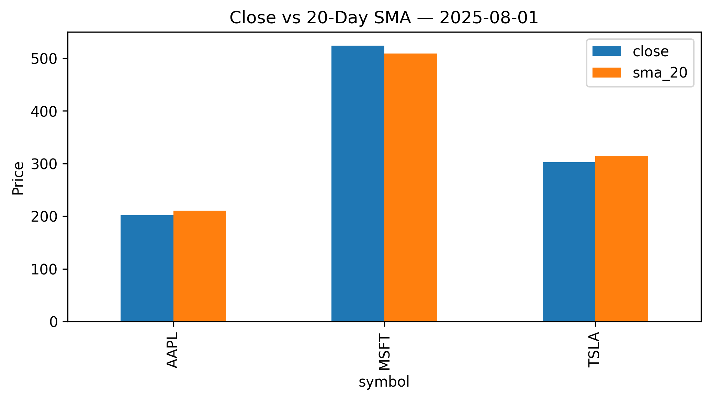

# Daily‑Price Mini‑Warehouse 📊

Small Python + SQLite project that:

1. **Fetches** daily OHLCV data (yfinance / Alpha Vantage)
2. **Stores** it in a relational schema  
3. **Computes** a 20‑day simple moving average (SQL window functions)  
4. **Generates** a Close vs SMA bar chart each night (matplotlib)  
5. **Automates** everything with Windows Task Scheduler  

